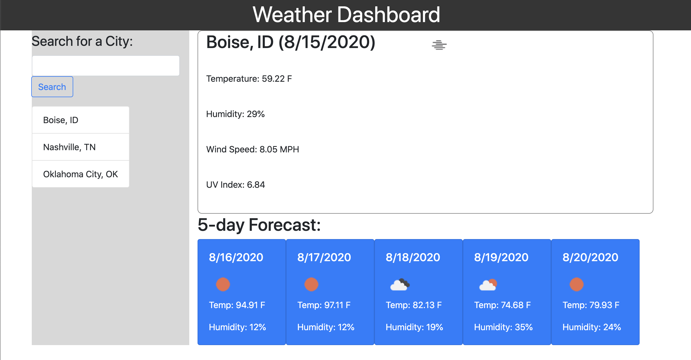

# WeatherDashboard

Weather Dashboard is a simple tool that allows you view current weather conditions and 5-day forecast information for a list of cities. Cities can be added to the list with the search funciton. List of added cities are saved in local storage for the next visit.

Preview:

See it in action:
[Click Me](https://outoftune266.github.io/06-Weather-Dashboard/)

USER STORY:
- WHEN USER wants to view weather information from a listed city
- THEN USER can click on a listed city and current conditions plus 5-day forecast info is displayed
- WHEN USER wants to add a city to the list of cities
- THEN USER can type a name of the city in the search bar and it is added to the list of cities and saved in local storage
- WHEN USER navigates away the site and then returns
- THEN saved cities are retrieved from local storage and displayed in the list

Future Development Goals:
- Add ability to clear list of cities

Contributors:
- Zak Monnet:   [Github Profile](https://github.com/outoftune266)

API's Used:
- OpenWeather API: [Website](https://openweathermap.org/api)
- OpenCage Geocoding API:   [Website](https://opencagedata.com/api)

Libraries Used:
- Bootstrap:   [Website](https://getbootstrap.com/)
- JQuery: [Website](https://materializecss.com/)
