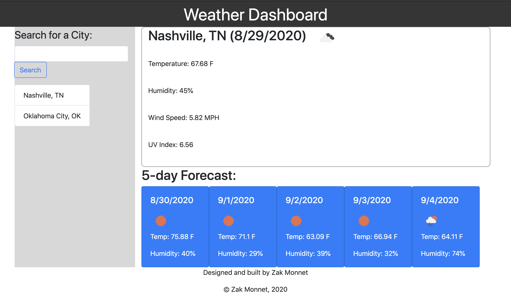

# 06-Weather-Dashboard
Homework #6

Preview:

Weather Dashboard

Application will retrieve and display current weather and 5-day forecast for a city

An initial list of the most important cities is provided

User can add a city to the list using the search bar

Added cities are saved in local storage and retrieved when user visits site again

See it in action:
[Click Me](https://outoftune266.github.io/06-Weather-Dashboard/)